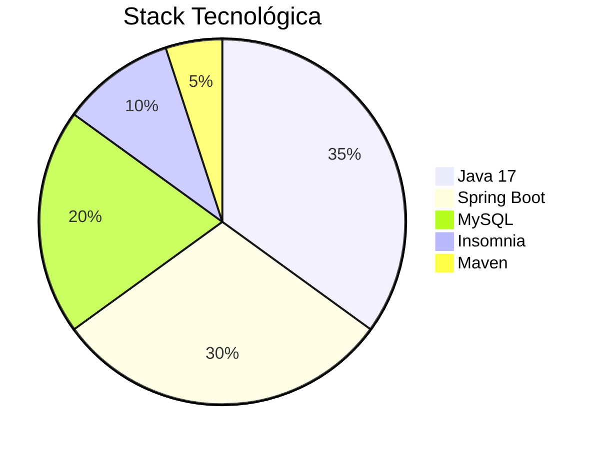

# Gerenciador de Tarefas Inteligente - Projeto Integrador Ada Tech/Meli


## 📌 Contexto do Projeto

Este projeto foi desenvolvido como **Projeto Integrador** do módulo **Técnicas de Programação** do curso **Desenvolva + Meli** da **Ada Tech** em parceria com o **Mercado Livre**.

## 🎯 Objetivos de Aprendizado

1. Aplicar conceitos avançados de **Java e programção funcional**
2. Implementar **boas práticas de programação**
3. Desenvolver habilidades de **arquitetura de software**
4. Praticar **trabalho em equipe** (Git, documentação)
5. Integrar **banco de dados relacionais** (MySQL)

## 🔍 Requisitos do Módulo Atendidos

| Técnica Aplicada | Onde foi Implementada |
|------------------|-----------------------|
| Programação Orientada a Objetos | Modelagem das classes e relações |
| Tratamento de Exceções | Validações e handlers de erro |
| Coleções e Streams | Operações com listas e filtros |
| Banco de Dados | Integração com MySQL |
| Testes Unitários | Suite de testes automatizados |
| Documentação | README e JavaDoc |

## 🛠️ Tecnologias Utilizadas



## 📚 Estrutura do Código

```
src/
├── main/
│   ├── java/com/ada/smarttasks/
│   │   ├── config/       # Configurações do Spring
│   │   ├── controller/   # Endpoints REST
│   │   ├── dto/          # Objetos de transferência
│   │   ├── exceptions/   # Tratamento de erros
│   │   ├── model/        # Entidades JPA
│   │   ├── repository/   # Interfaces Spring Data
│   │   ├── service/      # Lógica de negócio
│   │   └── utils/        # Utilitários
├── test/                 # Testes unitários
└── resources/            # Configurações
```

## 🚀 Como Executar o Projeto

1. **Configurar MySQL**:
```sql
CREATE DATABASE ada_tarefas;
CREATE USER 'ada_user'@'localhost' IDENTIFIED BY 'ada123';
GRANT ALL PRIVILEGES ON ada_tarefas.* TO 'ada_user'@'localhost';
```

2. **Clonar e executar**:
```bash
git clone https://github.com/seu-user/gerenciador-tarefas-ada.git
cd gerenciador-tarefas-ada
mvn spring-boot:run
```

## 🔗 Links Úteis

- [Documentação Ada Tech](https://ada.tech)
- [Material do Curso](https://ada.tech/sou-aluno)
- [Referência Spring Boot](https://spring.io/projects/spring-boot)

## 👨‍💻 Autora

- [Sandra Mastrogiacomo] - [sandramastrogiacomo@hotmail.com]


*Projeto desenvolvido como parte do programa de formação Ada Tech + Mercado Livre*

